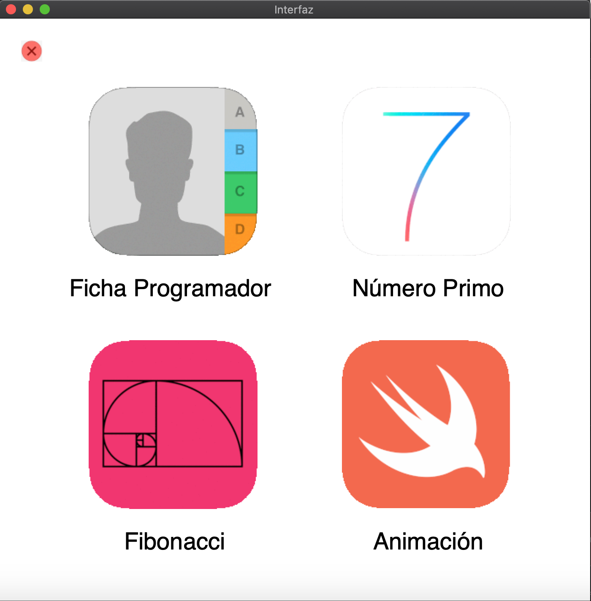
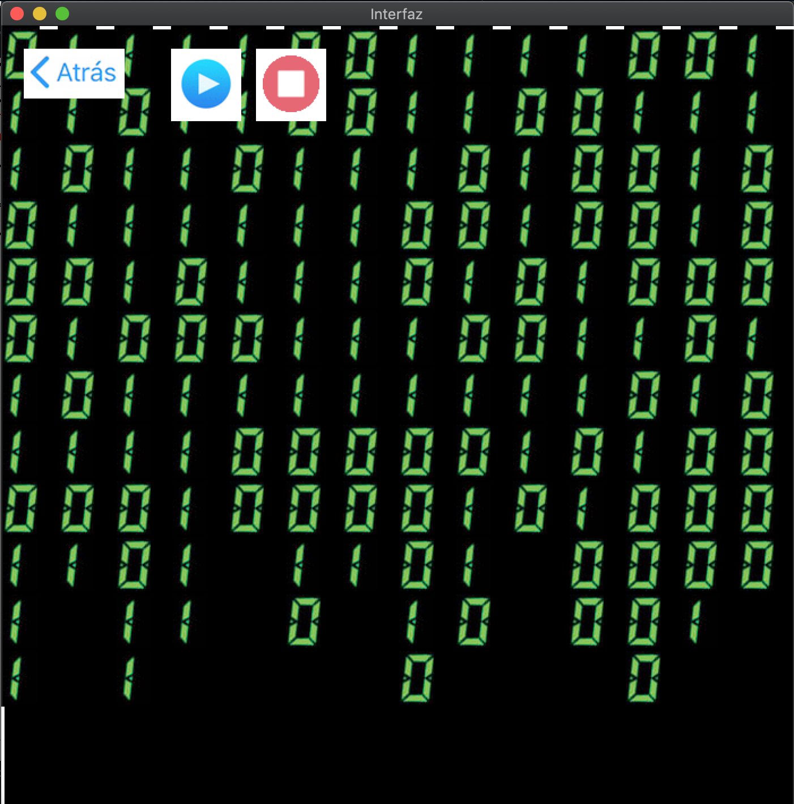

# TkinterGUI
CE-1102. Little Tkinter GUI with various functions. #Jeff

## Introduction

This was probably the first time I ever got an assignment from scratch. It went basically like "You have to make a GUI with this and this and this".
I remember I was a bit skeptical at the time, because I didn't know a thing about graphical stuff in Python, I barely even knew what a function was.
In the end, I learned a lot from this excercise. Mainly, that coding involved a whole bunch of research and testing stuff until it works. Fun for all ages.

Ooh, the animation was really cool, though. It was basically like in The Matrix with the green numbers falling. 
You can tell the whole design is inspired by Apple's iOS. I'm kind of in love with their simple colorful icons.

## Pictures

Menu                            |Cool Animation                      |
:------------------------------:|:------------------------------:
  |  

## Prerequisites

Default Python. Originally made in version 3.6.4 with macOS High Sierra 10.13.4 but tested in May 2019 for version 3.7.3 with macOS Mojave 10.14.6 and everything worked fine.
Uses subprocess library for audio reproduction, which comes bundled with macOS. 

It's possible it won't run as well on another OS.

## Authors

* **Alejandro Ibarra** - *Developer* - [AlejandroIbarraC](https://github.com/AlejandroIbarraC)

## Acknowledgments

* **Mr.Jeff Schmidt** - *Teacher* 

## License

This project is licensed under the GNU License - see the [LICENSE.md](LICENSE.md) file for details
